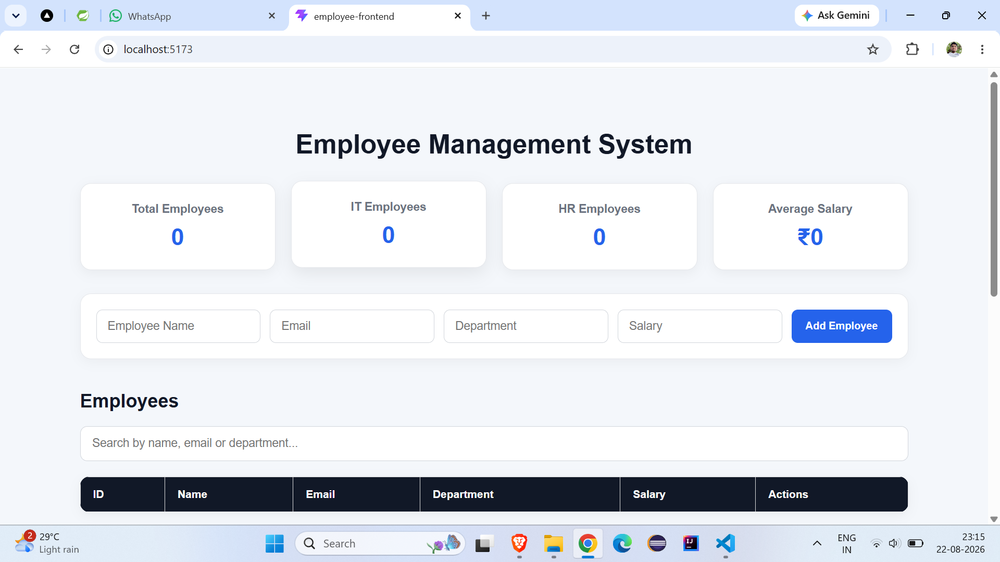
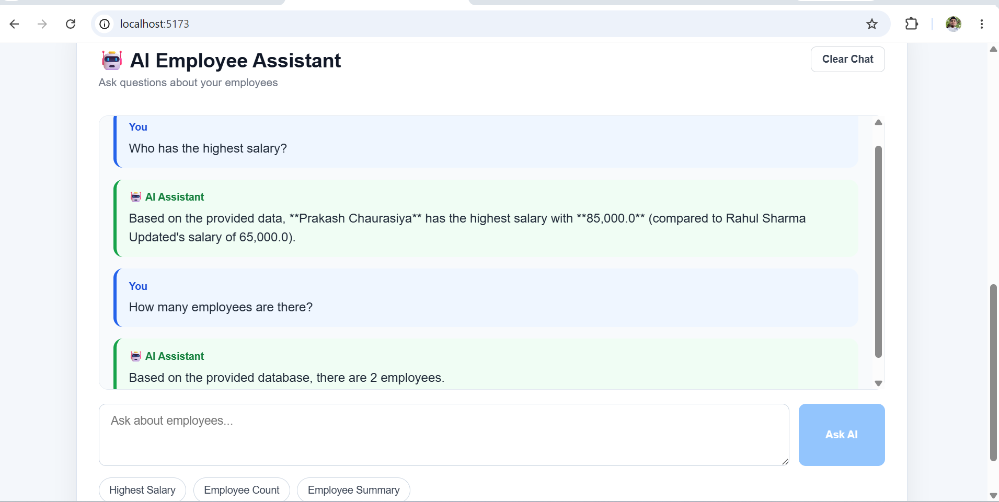

# Employee AI Assistant

An AI-powered Employee Management System built with Spring Boot, React, MySQL, and Google Gemini AI.

The application provides complete employee CRUD operations, dashboard analytics, search functionality, and an AI assistant that can answer questions about employee data.

## 🚀 Features

### Employee Management
- Add new employees
- View all employees
- Update employee details
- Delete employees
- Search employees by name, email, or department

## 📸 Screenshots

### Employee Management Dashboard



### AI Employee Assistant



### Dashboard
- Total employee count
- IT employee count
- HR employee count
- Average salary calculation

### AI Employee Assistant
- Ask questions using natural language
- Gemini AI integration
- AI responses based on employee data
- Conversation history
- Clear chat functionality
- Enter-to-send support
- Loading state while AI is processing

### REST APIs
- Employee CRUD REST APIs
- AI chat REST API
- Tested using Postman

## 🛠️ Tech Stack

### Backend
- Java 17
- Spring Boot
- Spring Data JPA
- Hibernate
- REST APIs
- Maven

### Frontend
- React
- JavaScript
- HTML5
- CSS3
- Vite

### Database
- MySQL

### AI
- Google Gemini
- Spring AI

### Tools
- Git
- GitHub
- Postman
- Visual Studio Code


## 📸 Screenshots

### Employee Management Dashboard


### AI Employee Assistant


## 🏗️ Architecture

```text
                React Frontend
                      |
                      | REST API
                      ↓
              Spring Boot Backend
                 /           \
                /             \
               ↓               ↓
          MySQL Database    Gemini AI
               |
               ↓
        Employee Data


## Project Structure

employee-ai-assistant/
│
├── src/
│   ├── main/
│   │   ├── java/
│   │   │   └── com/prakash/employee_ai_assistant/
│   │   │       ├── ai/
│   │   │       │   ├── AiController.java
│   │   │       │   └── AiService.java
│   │   │       │
│   │   │       ├── controller/
│   │   │       │   └── EmployeeController.java
│   │   │       │
│   │   │       ├── entity/
│   │   │       │   └── Employee.java
│   │   │       │
│   │   │       ├── repository/
│   │   │       │   └── EmployeeRepository.java
│   │   │       │
│   │   │       └── service/
│   │   │           └── EmployeeService.java
│   │   │
│   │   └── resources/
│   │       └── application.properties
│   │
│   └── test/
│
├── pom.xml
├── .gitignore
└── README.md

## API Endpoints

| Method | Endpoint              | Description       |
| ------ | --------------------- | ----------------- |
| GET    | `/api/employees`      | Get all employees |
| POST   | `/api/employees`      | Create employee   |
| PUT    | `/api/employees/{id}` | Update employee   |
| DELETE | `/api/employees/{id}` | Delete employee   |


## AI API

| Method | Endpoint       | Description           |
| ------ | -------------- | --------------------- |
| POST   | `/api/ai/chat` | Send a question to AI |


## Example AI Request

{
  "message": "How many employees are there?"
}

## AI Assistant Examples

The AI assistant can answer questions such as:

How many employees are there?

Who has the highest salary?

Which department does Prakash Chaurasiya belong to?

Show me information about employees.

Give me an employee summary.

onfiguration

## Create the required environment variable:

GEMINI_API_KEY

## The application reads the Gemini API key using:

spring.ai.google.genai.api-key=${GEMINI_API_KEY}

Database configuration:

spring.datasource.url=jdbc:mysql://localhost:3306/employee_ai_db
spring.datasource.username=${DB_USERNAME:root}
spring.datasource.password=${DB_PASSWORD:root}

## Run the Backend

Run the Backend
mvn spring-boot:run
http://localhost:8080


## Run the Frontend

cd employee-frontend
npm install
npm run dev
http://localhost:5173

## API Testing

The REST APIs were tested using Postman.

Example:
POST http://localhost:8080/api/ai/chat

Request:
{
  "message": "Who has the highest salary?"
}

## 🔐 Security

Sensitive credentials are not stored directly in the source code.

Environment variables are used for:

Gemini API key
Database credentials

The .gitignore file excludes build and local development files.

## Future Enhancements
Spring Security + JWT authentication
Role-based access control
Advanced AI employee analytics
AI-powered natural-language database queries
Salary and department charts
Swagger/OpenAPI documentation
Unit and integration testing
Docker deployment
Cloud deployment

## 👨‍💻 Author

Prakash Chaurasiya

Java Full Stack Developer | AI Integration

## GitHub:

https://github.com/prakashchaurasiya-25